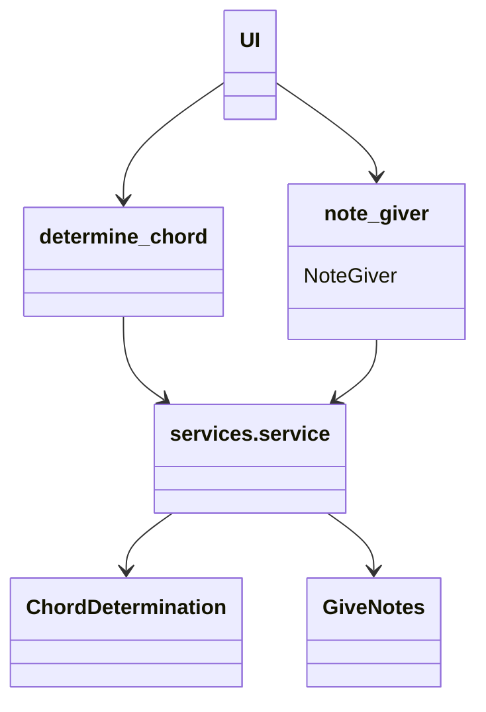

## Sointuohjelma

```mermaid
 classDiagram
      UI --> determine_chord
      UI --> note_giver
      determine_chord --> services.service
      note_giver --> services.service
      services.service --> ChordDetermination
      services.service --> GiveNotes
      
      class note_giver{
      NoteGiver
      }
      class determine_chord{
      }
      class services.service{
      }
      class ChordDetermination{
      }
      class ChordDetermination{
      }
      
```
