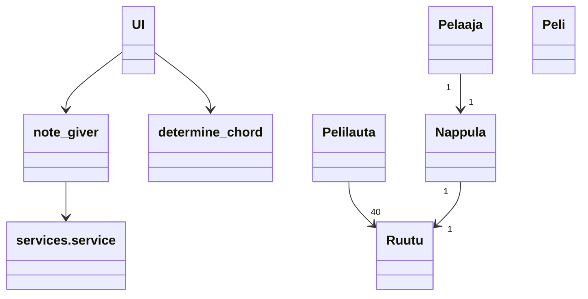

## Sointuohjelma

```mermaid
 classDiagram
      UI --> note_giver
      UI --> determine_chord
      note_giver --> services.service
      Pelaaja "1" --> "1" Nappula
      Pelilauta --> "40" Ruutu
      Nappula "1" --> "1" Ruutu
      
      class Pelaaja{
      }
      class Pelilauta{
      }
      class Peli{
      }
      class Nappula{
      }
      class Ruutu{
      }
      
```
