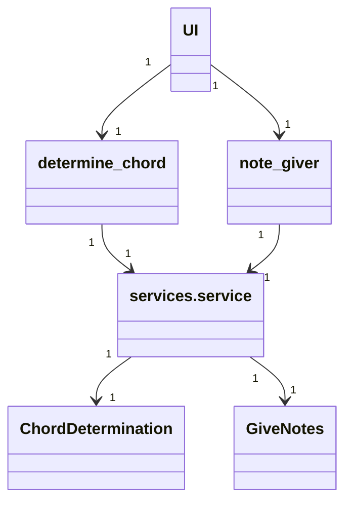

## Sointuohjelma

```mermaid
 classDiagram
      UI "1" --> "1" determine_chord
      UI "1" --> "1" note_giver
      determine_chord "1" --> "1" services.service
      note_giver "1" --> "1" services.service
      services.service "1" --> "1" ChordDetermination
      services.service "1" --> "1" GiveNotes
      
      
      class UI{
      }
      class note_giver{
      }
      class determine_chord{
      }
      class services.service{
      }
      class ChordDetermination{
      }
      class ChordDetermination{
      }
      
```
