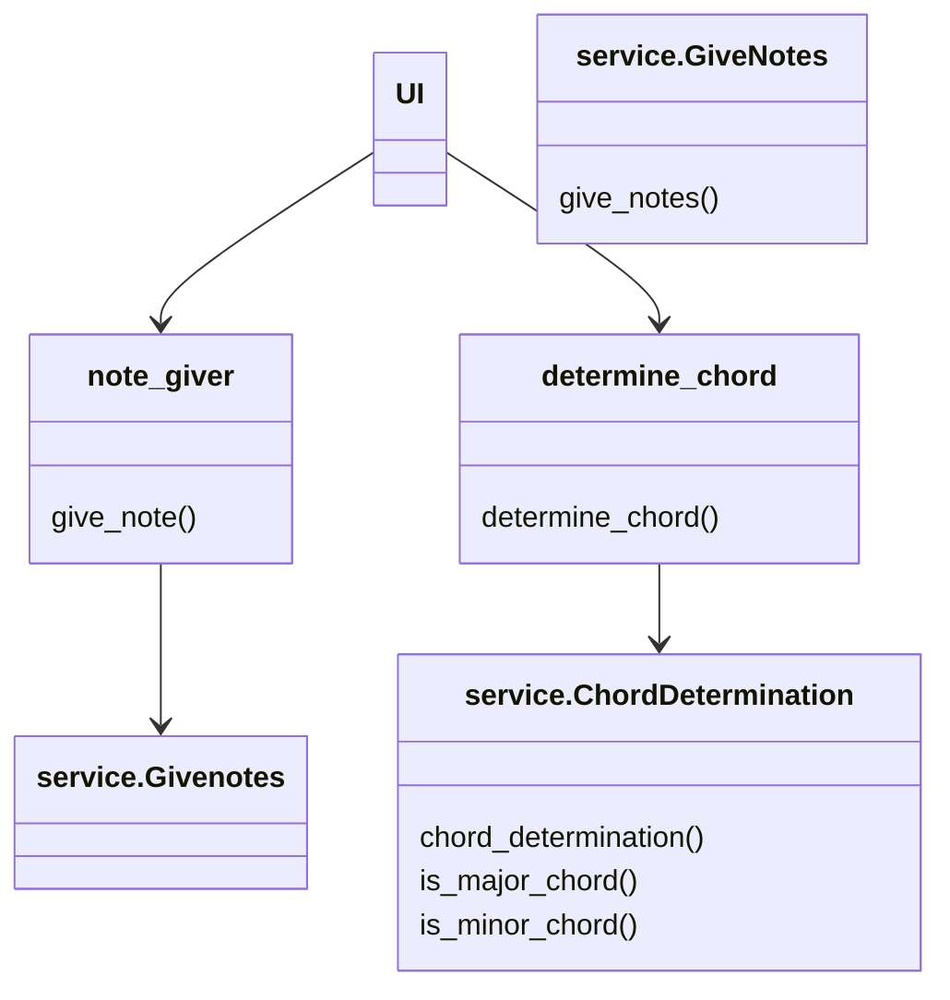

# Sointuohjelma

```mermaid
 classDiagram
      UI --> note_giver
      UI --> determine_chord
      note_giver --> service.Givenotes
      determine_chord --> service.ChordDetermination
      
      class service.ChordDetermination{
      chord_determination()
      is_major_chord()
      is_minor_chord()
      }
      class service.GiveNotes{
      give_notes()
      }
      class note_giver{
      give_note()
      }
      class determine_chord{
      determine_chord()
      }
      
```
