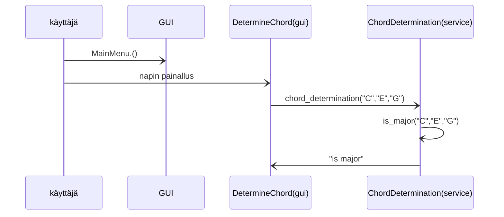
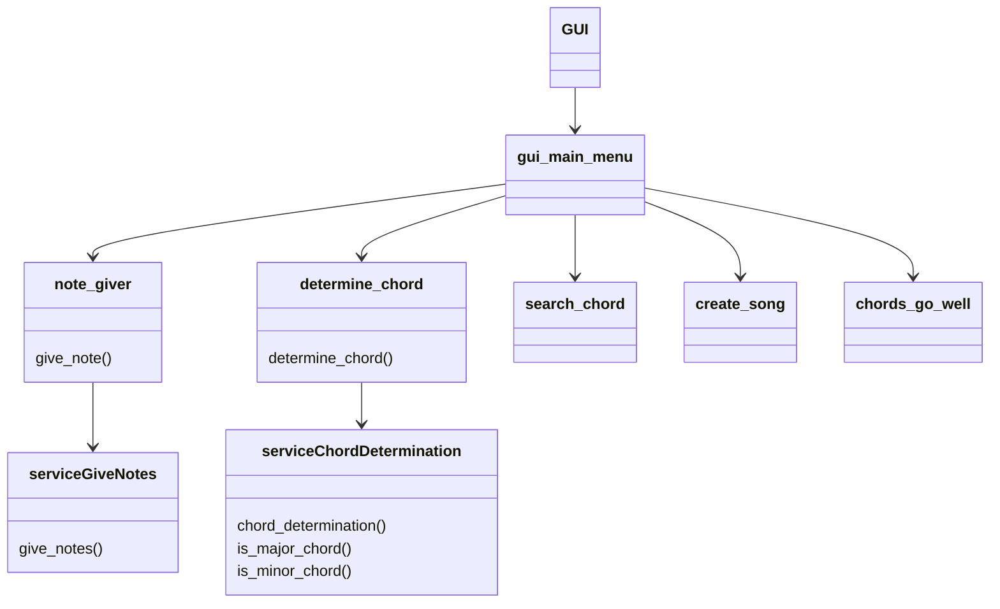

# Arkkitehtuurikuvaus

## Rakenne
Ohjelma käynnistää ensin UI:n  ja sitten heti GraafisenUI:n tämän jälkeen käyttäjä tekee jotain ohjelmalla ja siirrytään sovellulogiikkaan serviceen. Mikäli käyttäjä tahtoo lukea tai kirjoittaa uusia kappaleita niin siirrytään repositoriesiin. Tämän jälkeen palataan takaisin GUI:hin.

## Käyttöliittymä
Graafisessa käyttöliittymässä on 6 eri näkymää
- main menu
- determine chords
- give notes
- search songs
- create song
- what chords go well together

Jokaisella käyttöliittymällä on oma luokkansa.

## Sovelluslogiikka
Jokaisella sovelluksen toiminnallisuudella on oma luokkansa src/services/service tiedostossa. Jokainen toiminnallisuus vastaa yhtä käyttöliittymän näkymää. Otetaan esimerkkitoiminnallisuudeksi determine chord. Käyttäjä painaa ohjelman main menun ylintä nappia, josta siirrytää determine chord käyttöliittymään. Täällä käyttäjä antaa kolme säveltä - jokainen omaan laatikkoonsa. Käyttäjän klikatessa nappia jossa lukee enter, ohjelma siirtyy sovellulogiikasta vastaavaan luokkaan ChordDetermination jossa ovat metodit 
- chord_determination(self,note1,note2,note3)
- is_major_chord(self,note1,note2,note3)
- is_minor_chord(self,note1,note2,note3)
Ensimmäinen metodi tutkii tekevätkö annetut 3 säveltä kokonaista sointua. Toinen metodi tutkii onko sointu duurisointu vai ei - mikäli sointu on duuri niin metodi palauttaa sen ja siirrytään takaisin käyttöliittymään. Kolmanteen metodiin mennään mikäli sointu ei ole duuri. Tällöin ohjelma palauttaa soinnun ja tiedon siitä että se on mollisointu. Seuraavaksi käyttöliittymä tulostaa komentoriville soinnun joko olevan duuri- tai mollisointu tai sitten ei kumpikaan.

Ohessa sekvenssikaavio edellämainitusta toiminnosta

Sovelluksen eri toimminallisuuksien kaavio

