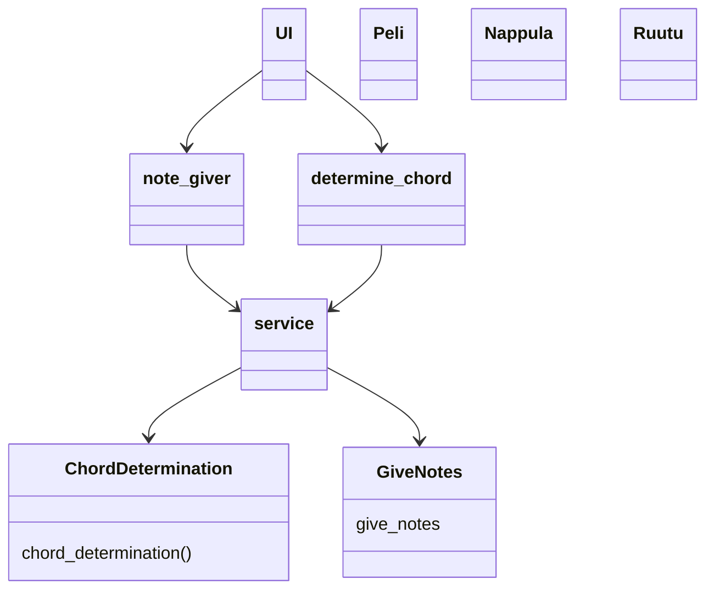

## Sointuohjelma

```mermaid
 classDiagram
      UI --> note_giver
      UI --> determine_chord
      note_giver --> service
      determine_chord --> service
      service --> ChordDetermination
      service --> GiveNotes
      
      class ChordDetermination{
      chord_determination()
      }
      class GiveNotes{
      give_notes
      }
      class Peli{
      }
      class Nappula{
      }
      class Ruutu{
      }
      
```
