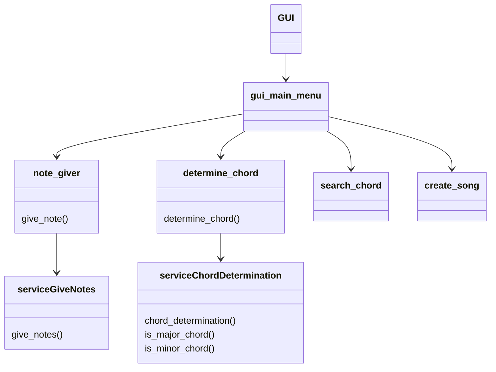

# Arkkitehtuurikuvaus
 

 
 

```mermaid
 classDiagram
      GUI --> gui_main_menu
      gui_main_menu --> note_giver
      gui_main_menu --> determine_chord
      gui_main_menu --> search_chord
      gui_main_menu --> create_song

      note_giver --> serviceGiveNotes
      determine_chord --> serviceChordDetermination
      
      class serviceChordDetermination{
      chord_determination()
      is_major_chord()
      is_minor_chord()
      }
      class serviceGiveNotes{
      give_notes()
      }
      class note_giver{
      give_note()
      }
      class determine_chord{
      determine_chord()
      }
      class gui_main_menu{
      }
      
      
```
