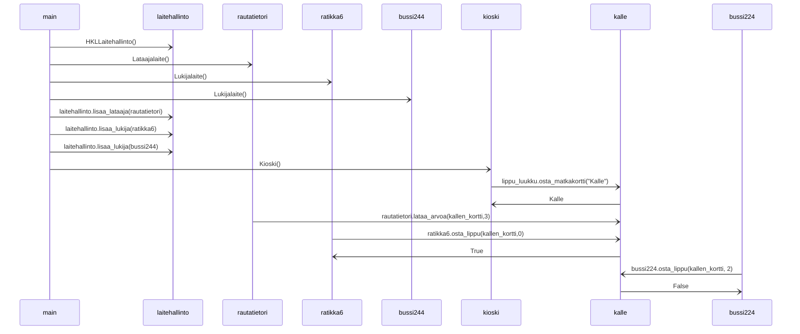

## HKL

```mermaid
sequenceDiagram
    main-)laitehallinto: HKLLaitehallinto()
    main-)rautatietori: Lataajalaite()
    main-)ratikka6: Lukijalaite()
    main-)bussi244: Lukijalaite()
    
    main-)laitehallinto: laitehallinto.lisaa_lataaja(rautatietori)
    main-)laitehallinto: laitehallinto.lisaa_lukija(ratikka6)
    main-)laitehallinto: laitehallinto.lisaa_lukija(bussi244)
    
    main-)kioski: Kioski()
    kioski-)kalle: lippu_luukku.osta_matkakortti("Kalle")
    kalle-)kioski: Kalle
    
    rautatietori-)kalle: rautatietori.lataa_arvoa(kallen_kortti,3)
    
    ratikka6-)kalle: ratikka6.osta_lippu(kallen_kortti,0)
    kalle-)ratikka6: True
    
    bussi224-)kalle: bussi224.osta_lippu(kallen_kortti, 2)
    kalle-)bussi224: False
```
