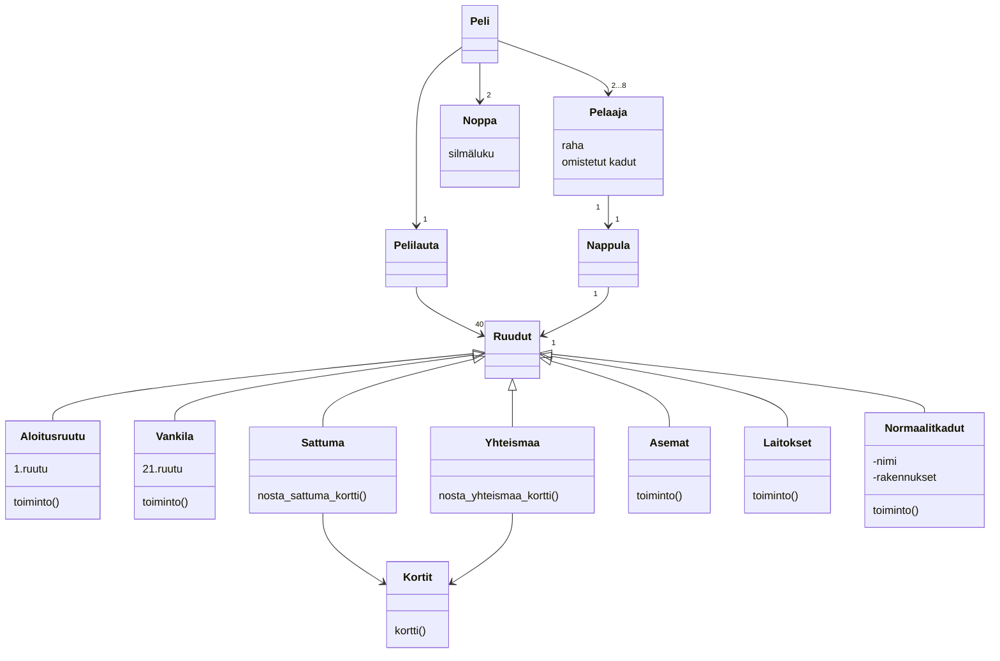

## Monopoli 2

```mermaid
 classDiagram
      Peli --> "2...8" Pelaaja
      Peli --> "1" Pelilauta
      Peli --> "2" Noppa
      Pelaaja "1" --> "1" Nappula
      Pelilauta --> "40" Ruudut
      Nappula "1" --> "1" Ruudut
      Ruudut <|-- Aloitusruutu
      Ruudut <|-- Vankila
      Ruudut <|-- Sattuma
      Ruudut <|-- Yhteismaa
      Ruudut <|-- Asemat
      Ruudut <|-- Laitokset
      Ruudut <|-- Normaalit kadut
      Sattuma --> Kortit
      Yhteismaa --> Kortit


      class Pelaaja{
      raha
      omistetut kadut
      }
      class Pelilauta{
      }
      class Peli{
      }
      class Noppa{
      silmäluku
      }
      class Nappula{
      }
      class Ruudut{
      }
      class Aloitusruutu{
      1.ruutu
      toiminto()
      }
      class Vankila{
      21.ruutu
      toiminto()
      }
      class Sattuma{
      nosta_sattuma_kortti()
      }
      class Yhteismaa{
      nosta_yhteismaa_kortti()
      }
      class Asemat{
      toiminto()
      }
      class Laitokset{
      toiminto()
      }
      class Normaalit kadut{
      -nimi
      toiminto()
      -rakennukset
      }
      class Kortit{
      kortti()
      }


```
